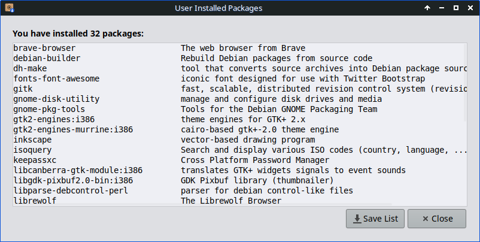

##User Installed Packages Help

This application is intended to facilitate the re-installation of packages that the user has added to the default installation.

It can display a list of packages manually installed by the user that can be saved in a simple text file. Furthermore, the application allows loading a saved list of packages for review and selection to be reinstalled. Such a procedure is especially easy and useful after a new system installation.

**There are two options to choose from:**

1. **quickly and easily create a list of those packages.**
2. **use that list in another location to review and reinstall those packages, if still available.**

###Create a list of user-installed packages

* A list of user-installed packages is displayed.
* Note: Packages of installed Linux kernels or NVIDIA graphics drivers will not be listed.

* Press [Save List] and select the location where the package list should be saved.
  
###Open a previously saved list to install selected packages

* Select the package list you wish to install.
* Uncheck any packages in the displayed list that you do not wish to install. 
* A notification is provided for any missing packages that can no longer be installed.

* Press [OK] and the selected packages will be installed.

###Unavailable packages will be listed

* Packages that are unavailable or uninstallable will be listed. 
* Such a situation arises when the main package or one of its dependencies can not function within the new system.
* Press [Save List] and select the location to save the list of unavailable packages.

###Packages available will be installed

* The installation process is started within a new terminal window.
* Authentication and confirmation are required to perform installation.
[comment]: # (A question "Do you want to continue? [Y/n]" is displayed in the terminal window. The question could be displayed translated, including [Y/N] for translated [Yes/No].)
* Press [N] to cancel.

* To close the terminal window after the installation process finishes, press [Enter].
   
Version: @VERSION@
Last updated: @DATE@
